# Practicum-II

### NCAA Men's Basketball Game Winning Prediction

Basketball is a sport that involves 10 players on a hardwood surface at one time. In the college game, 5 players from each team attempt to get a ball in a basket while trying to prevent the other team from doing so. In college, the basketball court is 94 feet long and 50 feet wide. The basketball hoop is 10 feet above the ground with a 6 foot wide, 42 inch tall backboard. The basketball rim is 18 inches in diameter. There are five positions in basketball. There is the guard, shooting guard, small forward, forward, and center positions. These positions are also referred to as positions 1 through 5. Usually the 1 (guard) position is the shortest player on the team, and best ball handler. The 1 usually handles the ball the most and runs the teams offense. Positions 4 and 5 are usually the tallest players on the team and collect the most rebounds.

The above is an oversimplification of the game as a team is made up of approximately 15 players, at varying positions, with varying skills, making varying contributions to the game. Every year, hundreds of Men's college basketball teams play at least 25 games in a season. As one can imagine, the playing of these games creates a multitude of stats that can be analyzed. The objective of this experiment is to determine, with what accuracy, a machine learning model can predict a win or a loss between two Men's NCAA basketball teams given historical measures. This experiment will be broken as follows:

1. Data Collection
2. Data Cleaning
3. Exploratory Data Analysis
4. Model Building (Decision Tree, Random Forest, K Nearest Neighbors, Support Vector Machines, Artificial Neural Networks)
5. Model Analysis
6. Summary

## Data Collection

All data has been gathered from the NCAA Men's Basketball Archived Statistics website

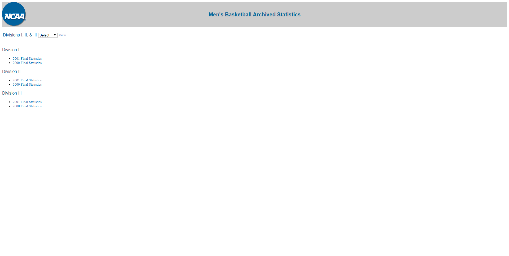

There are 3 divisions in Men's NCAA Basketball. These divisions and there respective teams are illustrated below:

#### Division 1 - 353 Teams

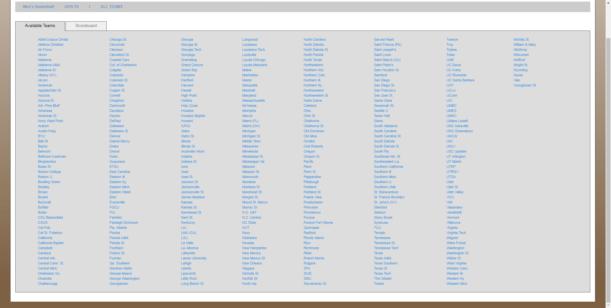

#### Division 2 - 309 Teams

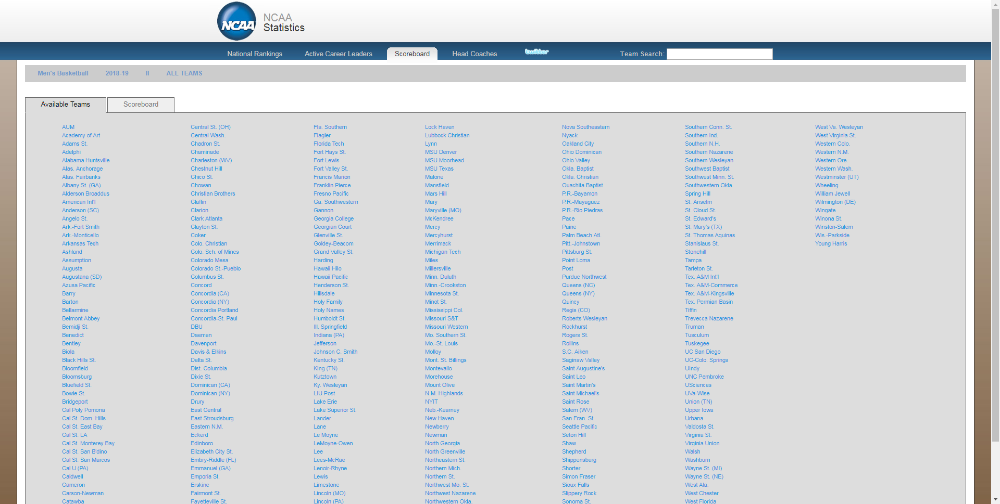

#### Division 3 - 427 Teams

The initial thought was to simply download the needed statistics from the NCAA Statistics website. However, upon further investigation, it was determined that this would not yield a statistical dataset rich enough with predictors. As a result, Python along with the BeautifulSoup library is used to scrape the website. Scraping the website allows for the collection of a dataset rich with predictors. It also allows for the data to be cleansed as it is collected and in a preferable, comma-separated format. While coding was like programming your way through 'soup', the BeautifulSoup library did assist with data extraction from a nested HTML data structure. The data extraction is broken down into Team Statistics, Team Results, and Player Statistics. One important note to point out is that the dataset is naturally balanced. That is, there will be an equal number of wins to losses. Put another way, for every team that wins there will be a team that losses.

#### Team statistics

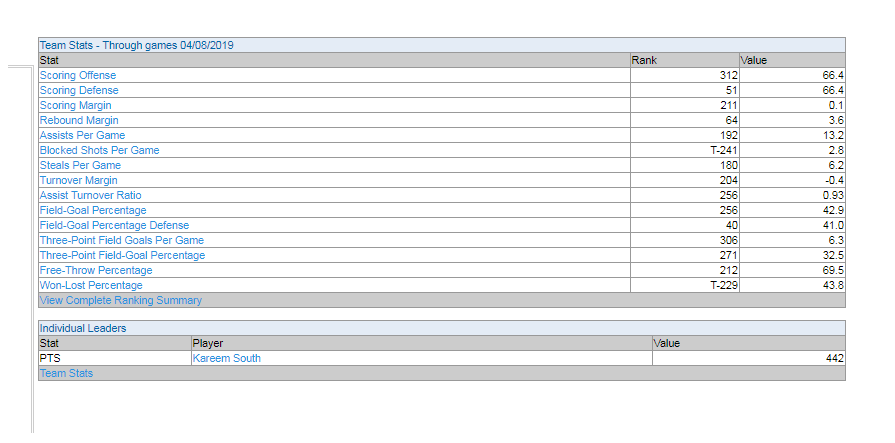

From the initial Division page above, each team is iterated through, using Python and BeautifulSoup, and it's team's statistics are recorded to a file. The following is the Team Statistics file header as extracted from code:

header = 'year_id' + delimiter +\
         'year_nm' + delimiter +\
         'team_id' + delimiter +\
         'team_nm' + delimiter +\
         'division' + delimiter +\
         'scoring_offense_rank' + delimiter +\
         'scoring_offense_value' + delimiter +\
         'scoring_defence_rank' + delimiter +\
         'scoring_defence_value' + delimiter +\
         'scoring_margin_rank' + delimiter +\
         'scoring_margin_value' + delimiter +\
         'rebound_margin_rank' + delimiter +\
         'rebound_margin_value' + delimiter +\
         'assists_per_game_rank' + delimiter +\
         'assists_per_game_value' + delimiter +\
         'blocked_shots_per_game_rank' + delimiter +\
         'blocked_shots_per_game_value' + delimiter +\
         'steals_per_game_rank' + delimiter +\
         'steals_per_game_value' + delimiter +\
         'turnover_margin_rank' + delimiter +\
         'turnover_margin_value' + delimiter +\
         'assist_turnover_ratio_rank' + delimiter +\
         'assist_turnover_ratio_value' + delimiter +\
         'field_goal_per_rank' + delimiter +\
         'field_goal_per_value' + delimiter +\
         'field_goal_per_defense_rank' + delimiter +\
         'field_goal_per_defense_value' + delimiter +\
         'three_pt_field_goals_per_rank' + delimiter +\
         'three_pt_field_goals_per_value' + delimiter +\
         'three_pt_field_goal_per_rank' + delimiter +\
         'three_pt_field_goal_per_value' + delimiter +\
         'free_throw_per_rank' + delimiter +\
         'free_throw_per_value' + delimiter +\
         'won_lost_per_rank' + delimiter +\
         'won_lost_per_value'

#### Team Results

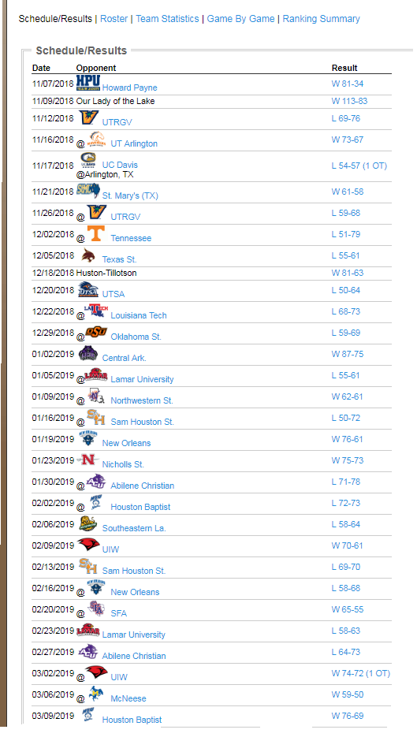

As the Python code iterates through teams, each team's results are recorded to a file. The following is the Team Results file header as extracted from code:

headerResults = 'year_id' + delimiter +\
                'year_nm' + delimiter +\
                'team_id' + delimiter +\
                'team_nm' + delimiter +\
                'division' + delimiter +\
                'date' + delimiter +\
                'opposing_team_id' + delimiter +\
                'opposing_team_nm' + delimiter +\
                'home_or_away' + delimiter +\
                'overtime' + delimiter +\
                'result' + delimiter +\
                'team_score' + delimiter +\
                'opposing_team_score'

#### Player Statistics

As the Python code iterates through teams, each team's player statistics are recorded to a file. The following is the Team Player Statistic's file header as extracted from code:

headerPlayerStatisticsPivot = 'year_id' + delimiter +\
                              'year_nm' + delimiter +\
                              'team_id' + delimiter +\
                              'team_nm' + delimiter +\
                              'division' + delimiter +\
                              'num_players' + delimiter +\
                              'jersey_01' + delimiter + \
                              'player_01' + delimiter + \
                              'year_01' + delimiter + \
                              'position_01' + delimiter + \
                              'height_01' + delimiter + \
                              'games_played_01' + delimiter + \
                              'games_started_01' + delimiter + \
                              'games_01' + delimiter + \
                              'minutes_played_01' + delimiter + \
                              'field_goals_made_01' + delimiter + \
                              'field_goals_attempted_01' + delimiter + \
                              'field_goal_percent_01' + delimiter + \
                              'three_point_01' + delimiter + \
                              'three_point_attempt_01' + delimiter + \
                              'three_point_percent_01' + delimiter + \
                              'free_throw_01' + delimiter + \
                              'free_throw_attempt_01' + delimiter + \
                              'free_throw_percent_01' + delimiter + \
                              'points_01' + delimiter + \
                              'average_01' + delimiter + \
                              'offensive_rebounds_01' + delimiter + \
                              'defensive_rebounds_01' + delimiter + \
                              'total_rebounds_01' + delimiter + \
                              'average_rebounds_01' + delimiter + \
                              'assists_01' + delimiter + \
                              'turn_overs_01' + delimiter + \
                              'steals_01' + delimiter + \
                              'blocked_shots_01' + delimiter + \
                              'fouls_01' + delimiter + \
                              'double_double_01' + delimiter + \
                              'triple_double_01' + delimiter + \
                              'disqualify_01' + delimiter +\

## Data Cleansing

Teams have a varied number of players on their roster. Some teams have 12 players while other teams have 17 players. Within this dataset, each team will be represented by 15 players. The above header portion represents 1 of the 15 players on a teams roster. If a team has less then 15 players, the missing players will be populated with zero stats. This will ensure that each roster is uniform. The model will decide if a team gets penalized for having less than 15 players on its roster. A team's roster can be made up of a different combination of positions. For example, a team can carry 10 guards and 5 forwards or 10 forwards, 2 guards, and 3 centers. In order to give the model every opportunity to discover patterns in the data the players on a roster must be ordered. The players could be ordered by any number of attributes. For the purpose of this experiment, each roster's players are ordered by the number of field goals the player made. The stats at position '01' will belong to the player that made the most field goals. The stats at position '02' will belong to the player that made the second most field goals. This order is maintained all the way through the 15th player. The ordering of the players on a single record is handled by the Python web-scraping script.                             

The following is a snapshot of output taken from the Python web-scraping script. It represents the 'AM-CORPUS-CHRISTI' team results from 2018:

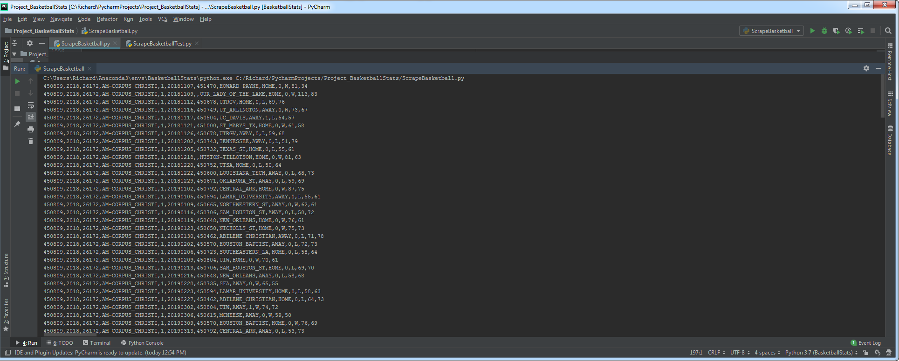

The following is a snapshot of output taken from the Python web-scraping script. It represents the 'AM-CORPUS-CHRISTI' player statistics from 2018:

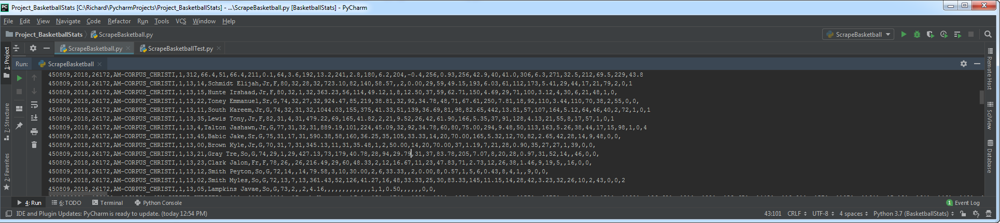

The following is a snapshot of output taken from the Python web-scraping script. It represents the 'AM-CORPUS-CHRISTI' sorted player statistics from 2018. Due to this roster only containing 13 players, it has been padded with 2 additional players with null stats:

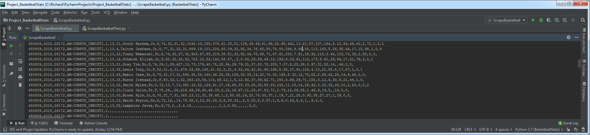

Lastly, the web-scraping script pivots the players to a single record maintaining order:

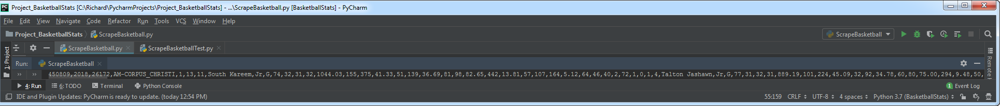

The Python script outputs three files. Additional data cleansing and bringing together 3 files to 1 file was done using an Oracle Cloud instance. This was used for its simplicity, power, and speed. Web scraping produced nulls for a small fraction of attributes. In addition, teams without at least 15 players on their roster were padded with null players. Oracle's data definition language was used to  default null columns to zero. Once the data was read into Oracle, the three tables were joined by division, year, and team in order to produce dataset records that contained team results, team statistics, and player statistics, again all on a single record. With cleansed data we can now move on to the next step.

## Exploratory Data Analysis

The desktop, student, version of Tableau was chosen to explore this rich dataset full of basketball statistics. The dataset contains 247,933 records each with 966 variables from three divisions of Men's college basketball, spanning years 2010 to 2018.

The following are a few illustrations of this dataset:

#### Number of Games Played by division

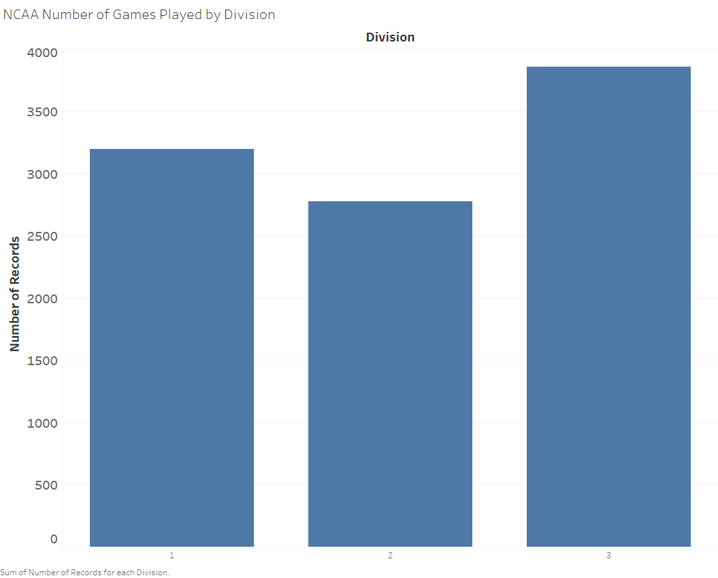

#### Average Scoring Offense - Average Scoring Defense - Field Goal Percentage - Three Point Field Goal Percentage

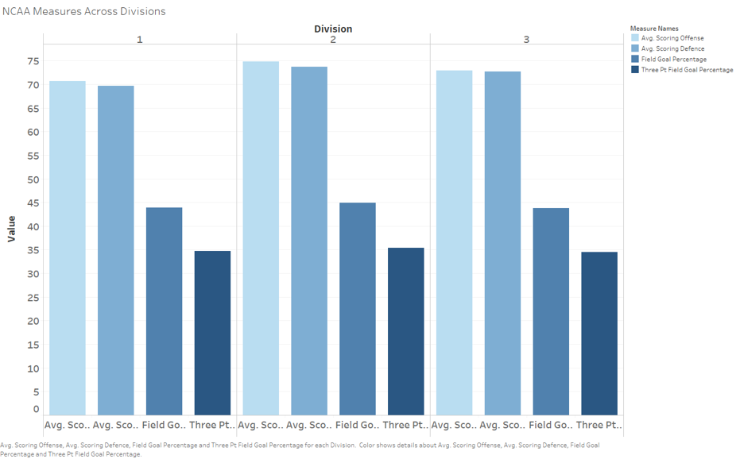

The above illustrates the divisions are fairly evenly measured with Division 2 having a slight edge.

#### The following focuses on Division 1 Teams:

This illustrates the Division 1 Top Ten Teams by Wins for the 2018-2019 season. Note Virginia did win the championship that year.

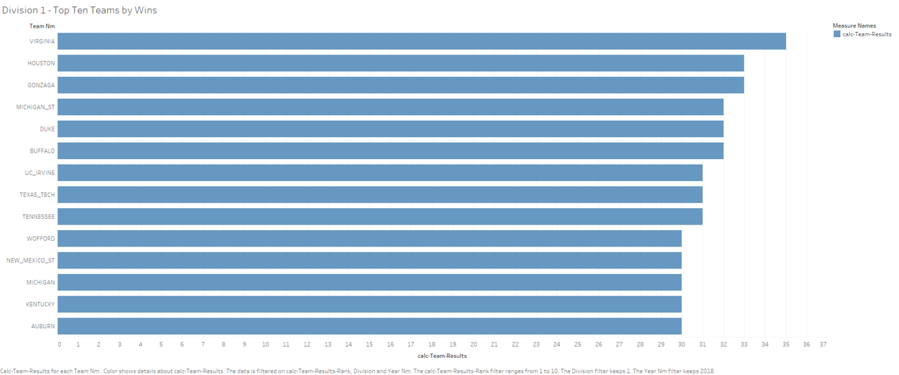

This illustrates the Division 1 Top Ten Teams by Score for the 2018-2019 season. Note, even though Virginia won the championship that year, they were not in the top 10 in scoring. Scoring alone does not determine a team's success.

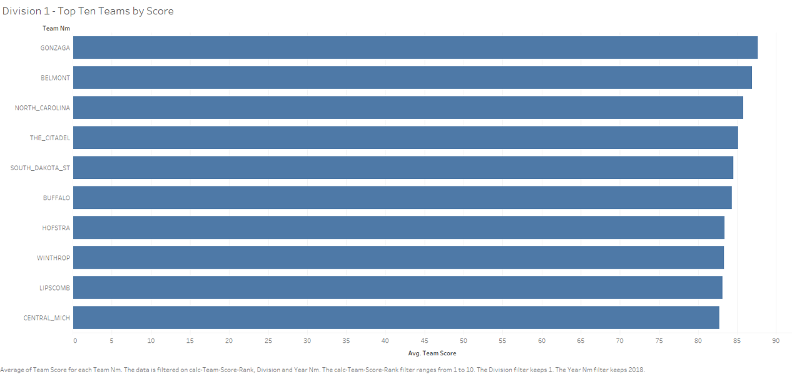

This illustrates the Division 1 Top Ten Teams by Scoring Defense for the 2018-2019 season. This measures the teams that allowed the fewest points to be scored against them through the course of the season. Virginia shows up as the number 1 team on this list. Scoring Defense may be a heavy contributor to a model build.

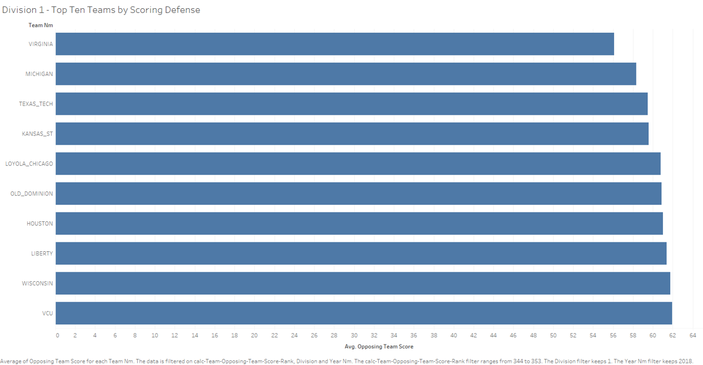

This next graphic brings the above attributes together.

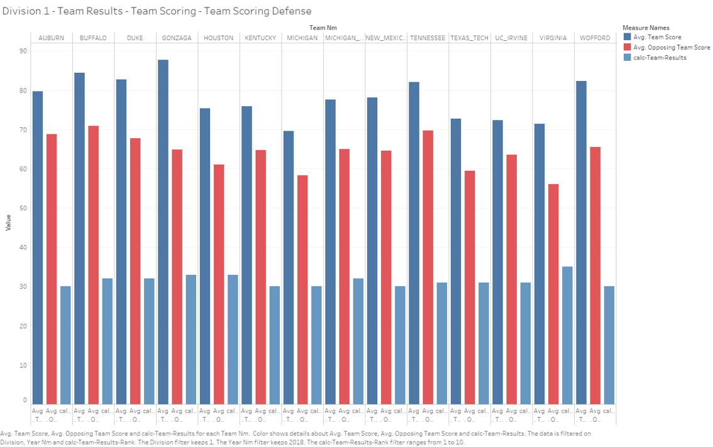

#### The following focuses on Division 1 Players:

The average height at the positions of guard, forward, and center are comparable across divisions.

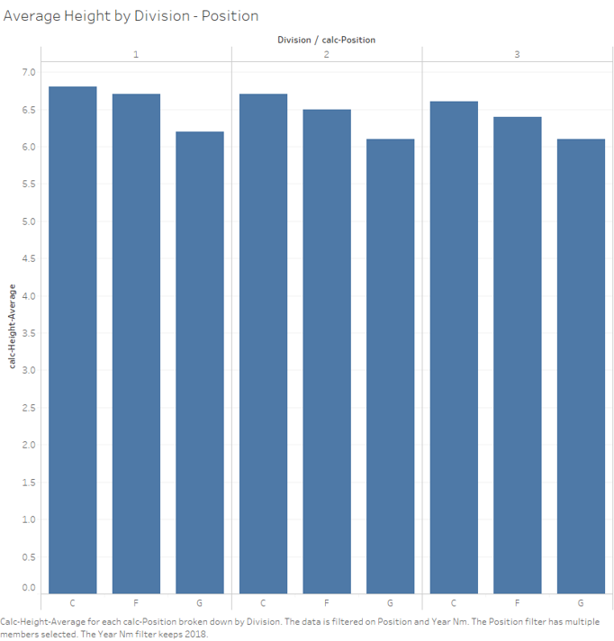

The average height is compared to field goals made. As the number of field goals go up, the average height goes down.

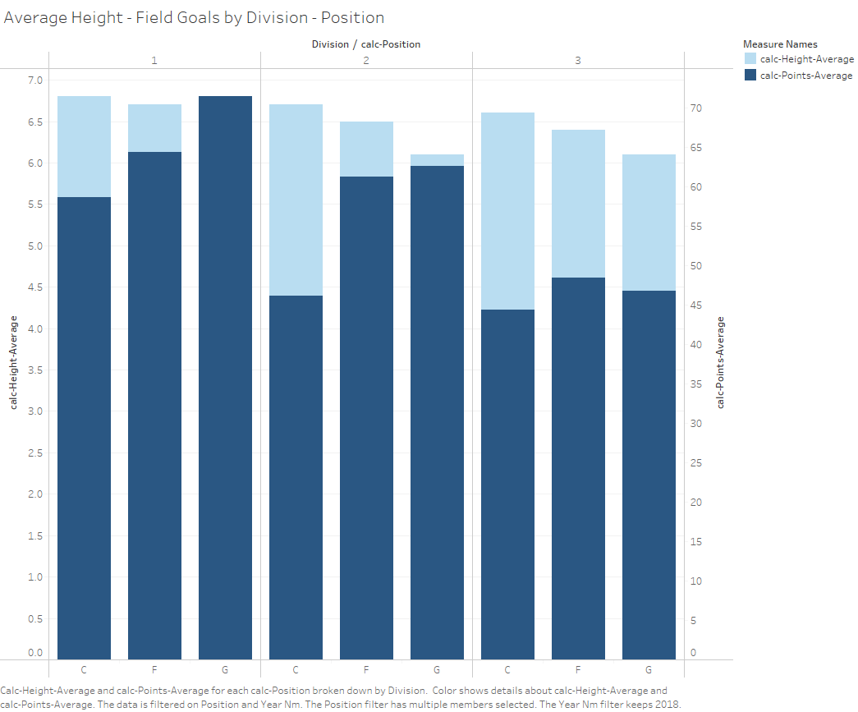

The following graphic illustrates the number of field goals attempted against the number of field goals made. The more you take. The more you make.

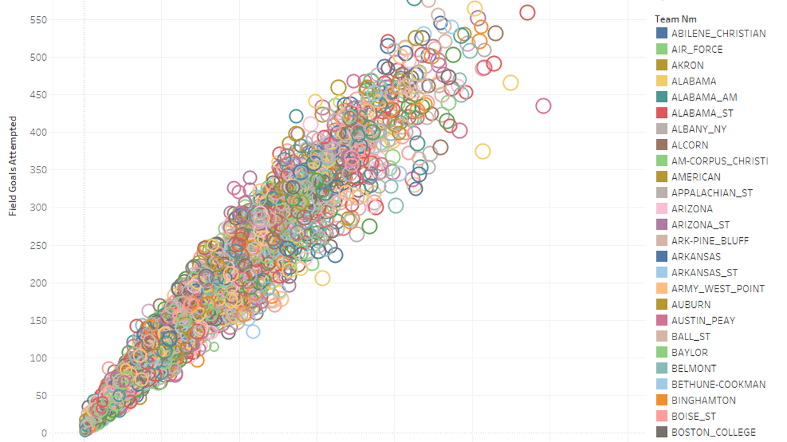

The above graphics are only a fraction of what tells the picture of a basketball game. With so many statistics represented within the dataset and so many more that could be represented, it is difficult to get a clear picture of what contributes to a win or a loss. Modeling the data is a step that can bring us closer to that answer.

## Data Modeling - Decision Trees

Decision Trees are a way of coming to a decision by divide and conquer until a class is met. For example, if a team's field goal percentage is greater than 50% go one way, if it is not go the other way. At the next tree node the split may be decided on a different attribute. For example, if player 5 has a free throw percentage less then 50% go one way, if not, go the other way.

The initial dataset being used is a 247,933 record set with 965 variables per record and 1 label per record. The following is a snapshot of this dataset. Note, this dataset has not been normalized.

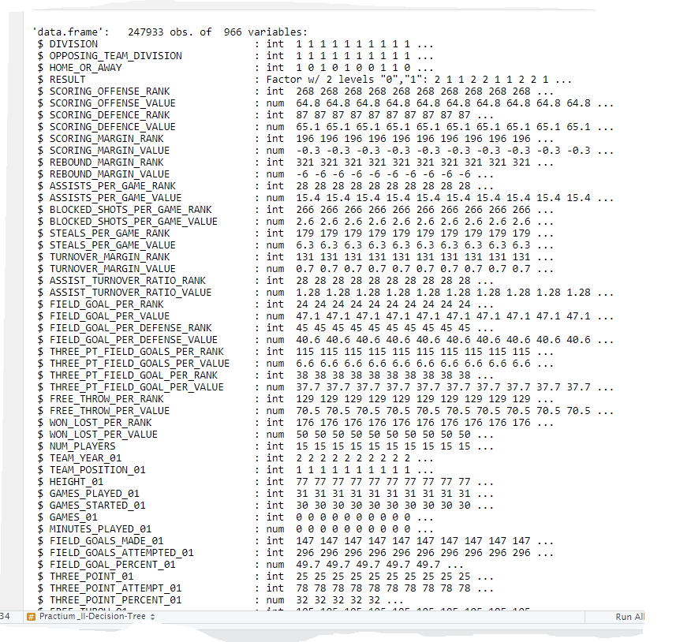

The following is the 10-fold cross-validated Decision Tree build. Note the top Accuracy achieved was 74% with a moderate Kappa of 0.485. With a perfectly balanced dataset of a label of win or loss, it becomes important that a model based on chance is ruled out. A Kappa of approximately 0.5 helps to rule out a 74% Accuracy of chance. Note it took 95 minutes to build this decision tree model on an AWS EC2 virtual instance with 64GB of ram. The building of this model took just over half of the 64GB of ram to build. Even though the EC2 instance had 4 CPU, only 1 CPU was used at 100% utilization. By default, R uses only one CPU although there are ways to parallelize model builds.

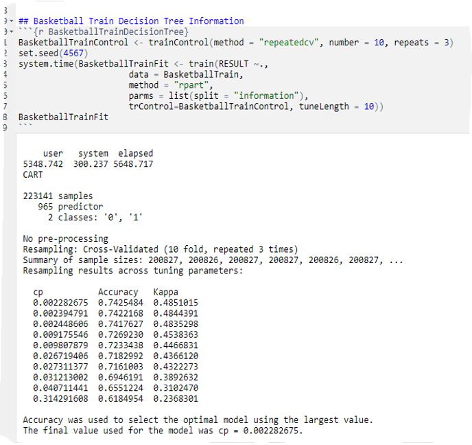

The below graphic illustrates the resultant Decision Tree. Note the top node splits on the opposition win/loss percentage:

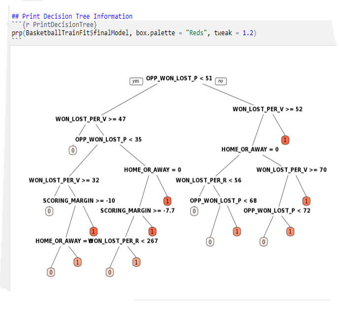

The following illustrates the confusion matrix of the above decision tree. If it were more important to predict a win or a loss, the Sensitivity and Specificity statistics would come into play. These statistics are fairly even at 73% and 75% respectively where a loss is predicted correctly 73% of the time and a win is predicted correctly 75% of the time. Note the dataset is labeled where a win is 0 and a loss is 1.

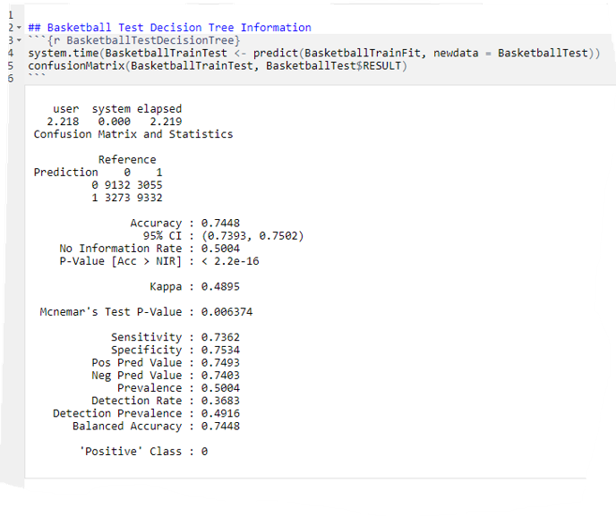

1. Accuracy = 0.7448
2. Kappa = 0.4895
3. Sensitivity = 0.7362
4. Specificity = 0.7534

Building other models with 965 predictors may become problematic. The decision tree model took 95 minutes to build. The next step analyzes which predictors were the most important in building the decision tree. In order to determine the most important variables, the 'varimp' function is used.

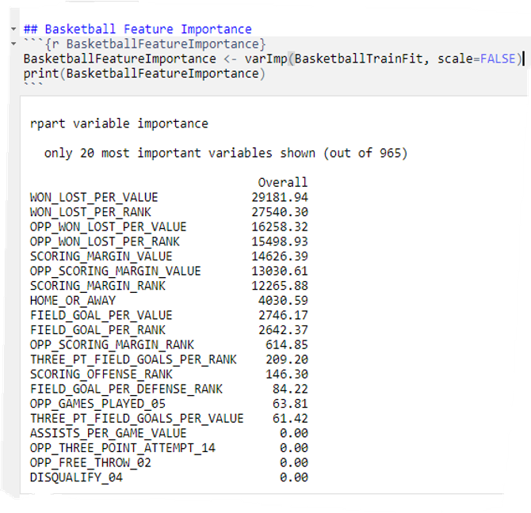

Much preparation went into getting to this point. 965 predictors were collected yet, based on decision tree, only 16 were important. The key statistics of the game are all covered in the top 16 predictors. One predictor that stands out is the 'OPP_GAMES_PLAYED_05'. This is the number of games the opposing team's 5th ranked (by field goals) player played. Of the 15 players, representing each team, this player was singled out as being important to the model.

## Data Modeling - Decision Trees - Normalized Dataset

The following is a snapshot of this dataset after normalization. Normalizing a dataset is a way of making sure no one attribute overpowers another during model build. Interestingly, the decision tree build, based on a normalized dataset yielded the same results for Decision Tree, Accuracy, Kappa, Sensitivity, and Specificity.

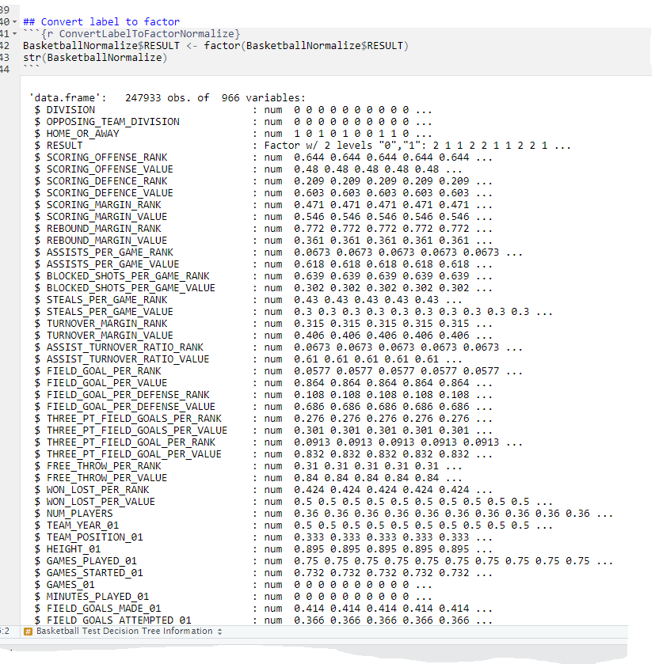

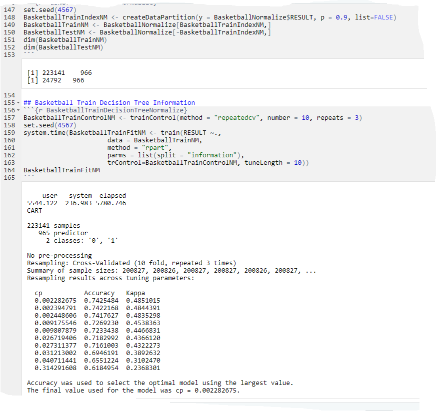

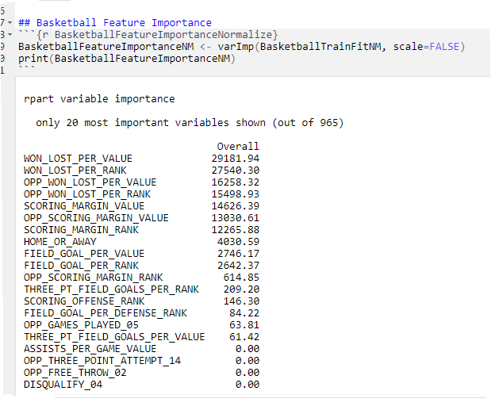

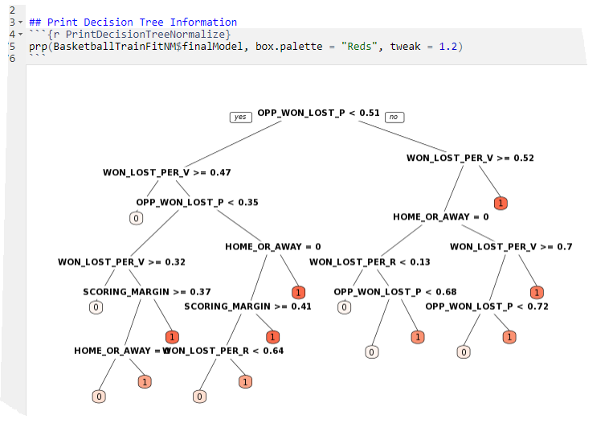

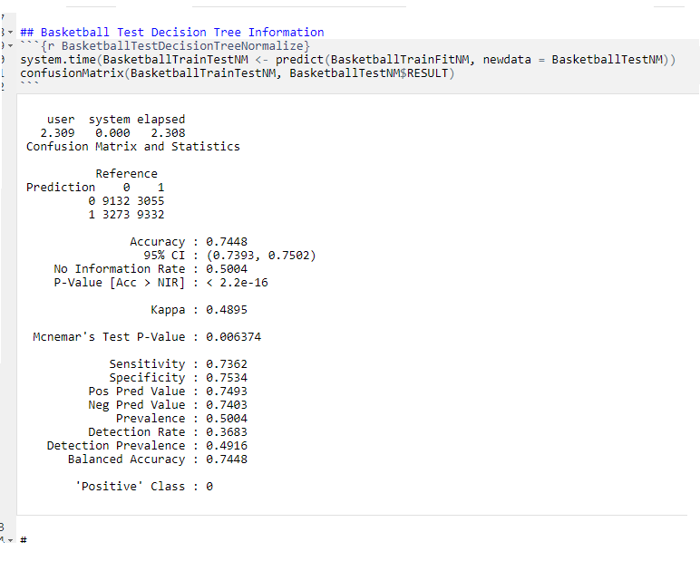

1. Accuracy = 0.7448
2. Kappa = 0.4895
3. Sensitivity = 0.7362
4. Specificity = 0.7534

The following is a correlation matrix of the 16 most important attributes. Note how the Win/Loss percentage value is negatively correlated to the Win/Loss percentage rank. As teams win more games their numerical rank becomes less. There are a number of highly correlated Value/Rank combinations and Rank/Rank combinations. Removing all Rank attributes may improve the model.

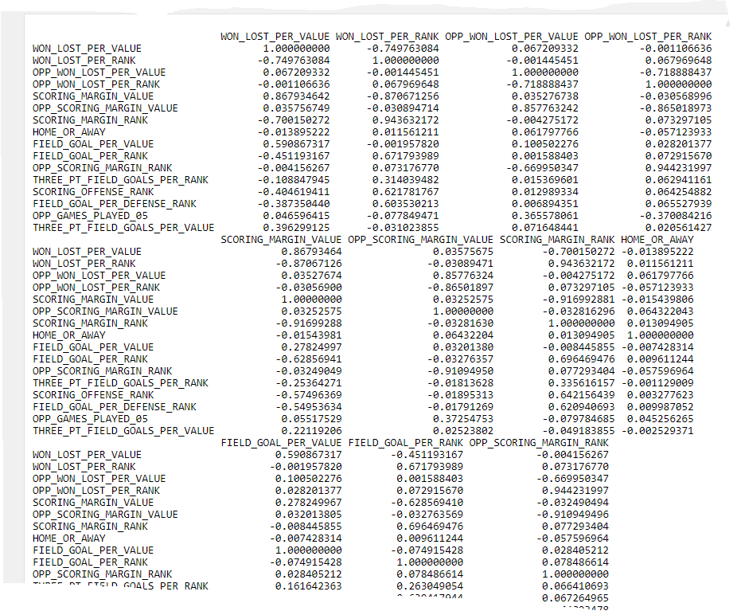

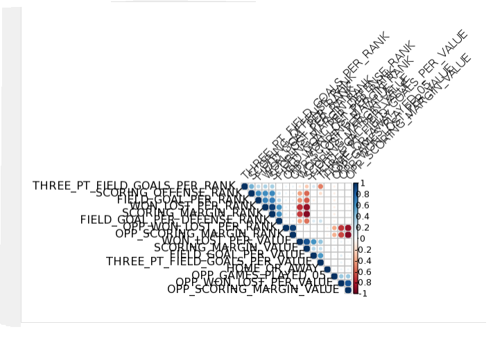

The following is the decision tree after having removed all 'Rank' columns.

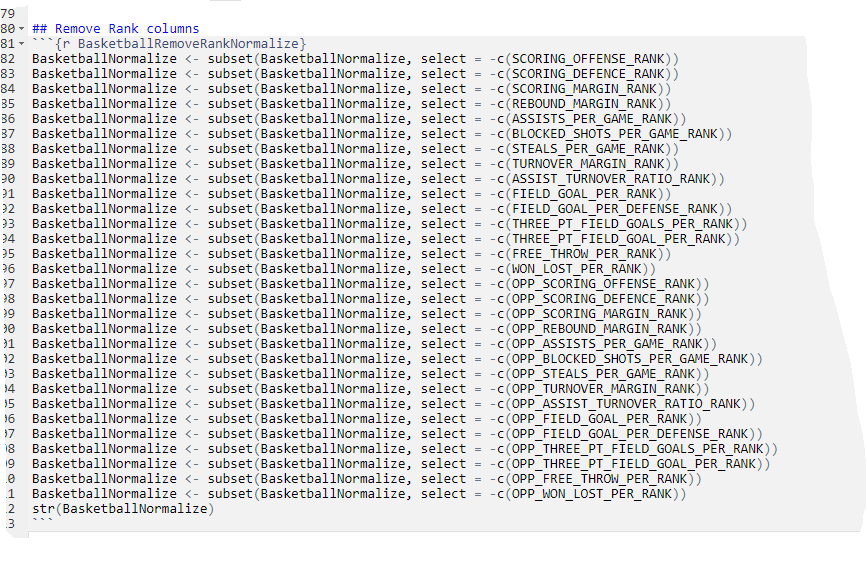

Note the Accuracy, Kappa, Sensitivity, and Specificity values, after cross-validation, are slightly less.

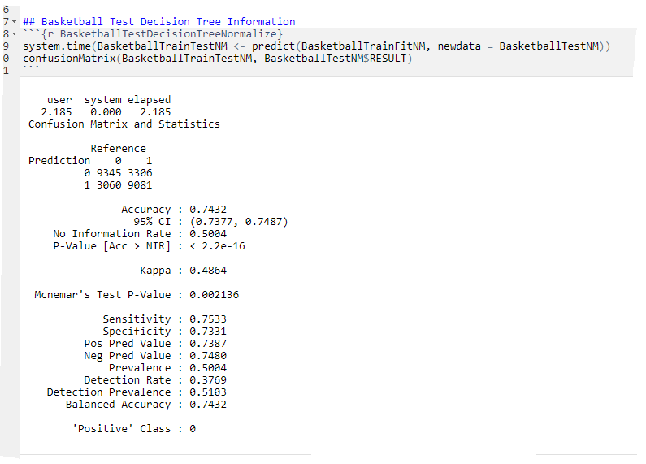

A new variable importance yields the following top 20 most important variables. Thes top 20 variables will be used for future models.

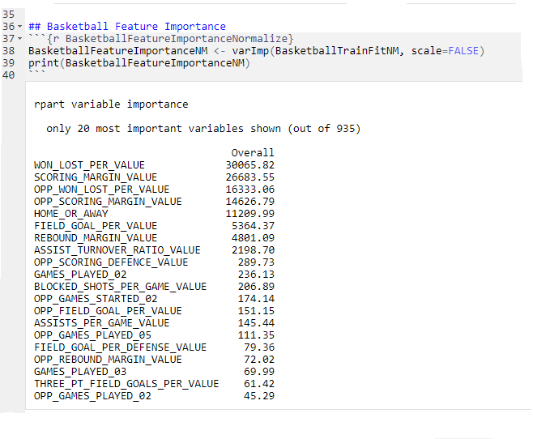

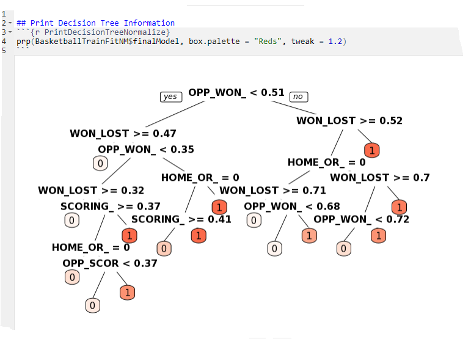

1. Accuracy = 0.7432
2. Kappa = 0.4864
3. Sensitivity = 0.7533
4. Specificity = 0.7331

## Data Modeling - Random Forest

Next, a Random Forest model is built, based on the 20 most important attributes outlined above. The purpose of Random Forest is to randomly select different attributes on which to split. These individual trees are then combined to form one 'majority' answer.

## Data Modeling - K Nearest Neighbors

KNN is a way of measuring the distance between an unlabeled object and labeled objects using a distance formula such as the Euclidean Distance. The majority vote of the closest K objects that are labeled to an unlabeled object wins. For example, if out of the 10 closest labeled objects to an unlabeled object, 7 are wins and 3 are losses, the unlabeled object will be labeled as a win. Note, in the case of this dataset, the winning team's statistics and the losing team's statistics are all represented on the same record. The win or loss label is with respect to the 'team' on the record, not the 'opposing team' on the record.

## Support Vector Machines

Support Vector Machines attempt to separate data points using n-dimensional space. By separating data points, majority rule can take place. For example, if based on attributes, records can be separated, a group can be classified by its majority label. After running SVM on the 20 most important variables, as computed by the Decision Tree model, the results follow. Note, the statistical values of Accuracy, Kappa, Sensitivity, and Specificity all fall in line with that of Decision Tree.

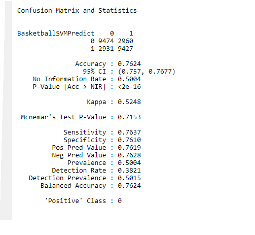

1. Accuracy = 0.7624
2. Kappa = 0.5248
3. Sensitivity = 0.7637
4. Specificity = 0.7610

## Artificial Neural Networks

Artificial Neural Networks determine how much an attribute or combination of attributes contribute to a class. ANNs are resource intensive. The 20 most important attributes were used. This limited dataset may have contributed to the lack of accuracy of this model. With 20 attributes and a 223,141 record training dataset, the model took approximately 6.7 hours to build. It would be interesting to see if adding additional attributes will increase the accuracy of this model.

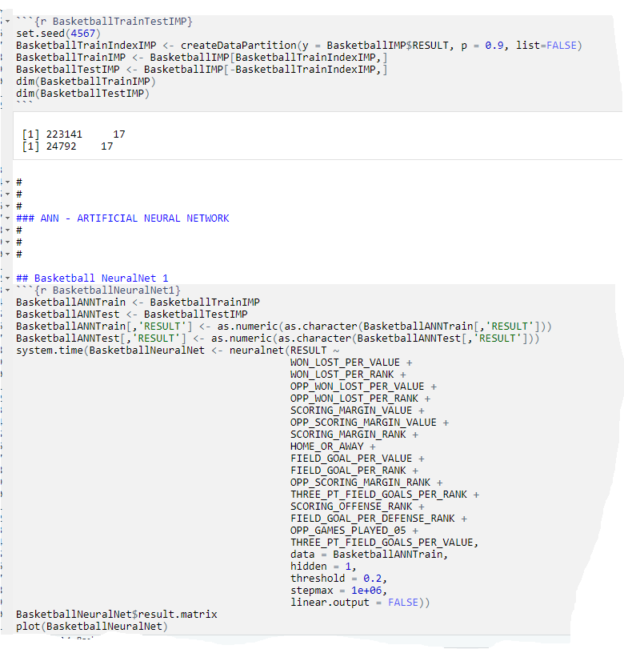

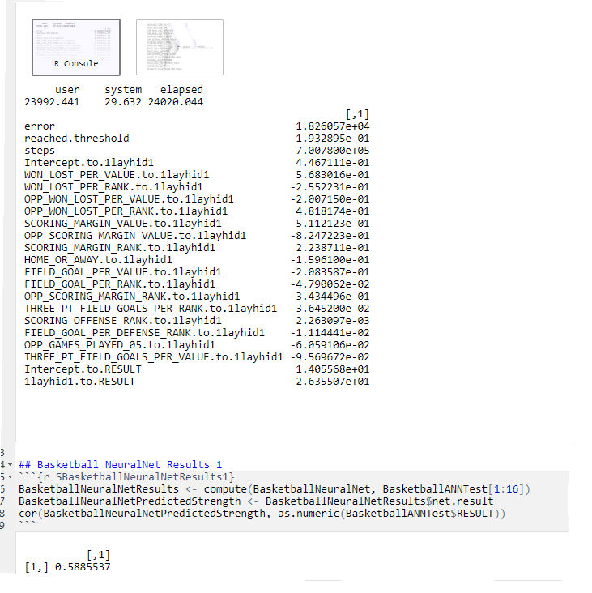

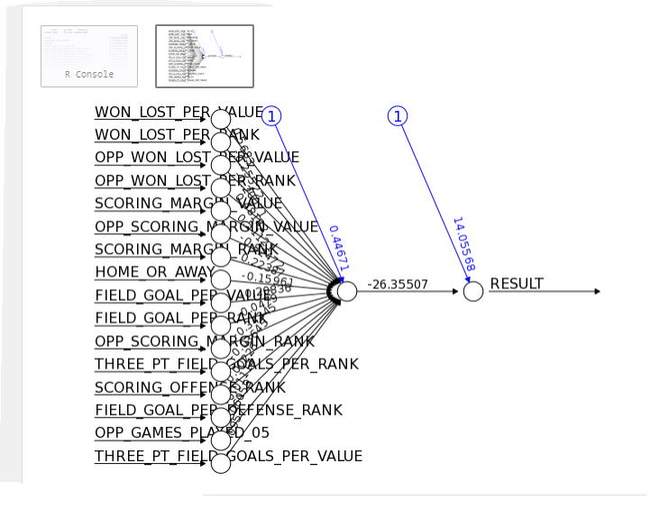

## Model Statistics Summary

## References

#### Lantz, B. (2015). Machine Learning with R. Birmingham, UK: Packt.

#### Saxena, R. (2017). Decision Tree Classifier Implementation in R, Retrieved 12:00, June 2, 2019, from http://dataaspirant.com/2017/02/03/decision-tree-classifier-implementation-in-r/

#### Brownlee, J., R. (2014). Feature Selection with the Caret R Package, Retrieved 12:30, June 2, 2019, from https://machinelearningmastery.com/feature-selection-with-the-caret-r-package/

#### Brownlee, J., R. (2016). Tune Machine Learning Algorithms in R (Random Forest Case Study), Retrieved 13:00, June 2, 2019, from https://machinelearningmastery.com/tune-machine-learning-algorithms-in-r/

#### Big Computing. (2018). Big Computing, Retrieved 13:30, June 2, 2019, from http://bigcomputing.blogspot.com/2014/10/an-example-of-using-random-forest-in.html

#### Guru99. (2018). R Random Forest Tutorial with Example, Retrieved 14:00, June 2, 2019, from https://www.guru99.com/r-random-forest-tutorial.html

#### Tahsildar, S. (2019). Gini Index for Decision Trees, Retrieved 14:30, June 2, 2019, from https://blog.quantinsti.com/gini-index/

#### RDocumentation. (2019). svm, Retrieved 20:00, June 3, 2019, from https://www.rdocumentation.org/packages/e1071/versions/1.7-1/topics/svm

#### RDocumentation. (2019). neuralnet, Retrieved 20:00, June 3, 2019, from https://www.rdocumentation.org/packages/neuralnet/versions/1.44.2/topics/neuralnet

#### Black, P. (2019) Manhattan Distance. Retrieved 20:00, May 15, 2019 from  https://www.nist.gov/dads/HTML/manhattanDistance.html

#### Sehra, C. (2018). Decision Trees Explained Easily. Retrieved 12:00, May 30, 2019 from https://medium.com/@chiragsehra42/decision-trees-explained-easily-28f23241248

#### Sam, T. (2018) Entropy: How Decision Trees Make Decisions.  Retrieved 09:00, May 30, 2019 from  https://towardsdatascience.com/entropy-how-decision-trees-make-decisions-2946b9c18c8

#### Eight to Late. (2019). A Gentle Introduction to Support Vector Machines Using R. Retrieved 12:00, June 5, 2019 from https://eight2late.wordpress.com/2017/02/07/a-gentle-introduction-to-support-vector-machines-using-r/
